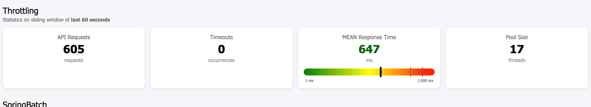

# Neterium Client SDK : Spring Boot module

The **neterium-sdk-spring-boot** is the central module of the SDK, gathering all building blocks ("*components*"
in Spring terminology) that you may use to develop a client application.

<!-- TOC -->

* [Build](#build)
* [Overview of available components](#overview-of-available-components)
* [Operational components](#operational-components)
    * [Token service](#token-service)
    * [Throttler component](#throttler-component)
    * [Api components](#api-components)
    * [Spring Batch components](#spring-batch-components)
* [Functional components](#functional-components)
    * [Screening components](#screening-components)
    * [Matching components (Hit handler)](#matching-components-hit-handler)
    * [Mapping components](#mapping-components)

<!-- TOC -->

## Build

Please refer to the documentation in the [root](../README.md) module to learn how to build the SDK.

## Overview of available components

We can distinguish two different categories of components:

- the first category includes components that you just need to register and configure, but which are then operating
  behind the scene. Once configured, you do not have to care anymore about them, they will automatically manage what
  they are intended to manage.
  <br/><br/>
  Examples:
    - the `TokenService` managing automatic token renewal for authentication
    - the `Throttler` component with automatic real-time calibration of the request rate


- the second category includes components offering high-level features to simplify and accelerate the development.
  Concretely these components can take the form of a ready-to-use `@Component`, or of a base class or interface
  you can instantiate (with some options) or inherit from.
  <br/><br/>
  Examples:
    - the `ScreeningTemplate` allows you to send any collection of *Screenable* parties or transactions
      to Neterium screeners with a very few lines of code
    - the `Pacs008Converter` allows you to parse an ISO PACS-008 file of transactions, and convert it
      to the input structure/payload claimed by Neterium screening API
    - the `MatchVerifier` allows you to optionally plug a custom component to query your local system
      (database) in order to filter out identified matches

---

## Operational components

### Token service

As its name suggests it, the  [TokenService](src/main/java/com/neterium/client/sdk/security/TokenService.java)
is:

- managing the acquisition of authentication tokens (which are mandatory to perform any call of Neterium API)
- providing ready-to-use and always-valid API tokens.

Under the hood, this component is going to

- fetch a new JWT token (using OAuth2 protocol)
- make it available as bearer token for any subsequent API call (see [Api](#api-components) components)
- cache it for potential re-use
- monitor its expiration date
- automatically renew it (using OAuth2 protocol) when expired

The `TokenService` exists in two flavors:

- an **EAGER** implementation where tokens are **proactively** renewed (just a few seconds before
  expiration).
- a **LAZY** implementation where tokens are renewed when **effectively** needed, avoiding thereby
  unnecessary refresh (in case no API call is made for a certain time).

The TokenService may be entirely configured without any single line of code, just by adding some settings in your
Spring configuration file:

**application.yaml**

```yaml
neterium:

  tokens:
    prefetch: true              # Pre-fetch token on application startup
    eager: true                 # Pro-active mode
    expiration-offset-sec: 2    # 2 sec before expiration

  # You can potentially define multiple API keys...
  api-keys:
    dev-key:
      username: dev001
      password: ...
    test-key:
      username: test_37f3
      password: ...

  api-server:
    key-id: test-key   # ..whose one of them will be used in API calls
```

---

### Throttler component

The [Throttler](src/main/java/com/neterium/client/sdk/throttling/Throttler.java) is a major component of the SDK; its
purpose is to regulate the flow of
screening requests to JetFlow™ or JetScan™ endpoints.
Concretely speaking, the throttler will constantly calibrate the system in order to compute an optimal value
that is maximizing the throughput while keeping acceptable response times from Neterium API.

Neterium infrastructure has some auto scale-up capabilities, allowing additional node(s) to be started to cope with
a sudden peak in terms of number of screening requests, or in CPU usage.
Once such new node is mounted, the system will (after a few seconds) potentially respond faster, and therefore be
able to accept more requests. Inversely, when the system is scaled down, response time might degrade a bit.

This is where the throttler comes into play : it will monitor the collected response times, analyze them,
and take the decision to increase, decrease or maintain a kind of bandwidth.
The computed bandwidth will then be materialized into a number of concurrent (parallel) threads issuing HTTP
screening requests to Neterium servers (see `DynamicThreadPoolManager` class, which is listening to any change
on the throttling value to update its pool size).

Though powerful, the throttler yet requires some complex parameterization, that is explained here.
Very often, multiple experiments are needed before finding a good combination of parameter values.

**application.yaml**

```yaml
neterium:
  throttling:
    window:
      size: 60s               # param S
    metric:
      name: MEAN              # param M
      min-count: 25           # param N
    durations:
      threshold-value: 1s     # param T
      threshold-ratio: 0.9    # param R
    timeouts:
      max-occurrences: 4      # param C
    calibration:
      initial-value: 3        # param I
      max-value: 20           # param X
      variation-amount: 0.025 # param V
```

Here are the explanations of its functioning:

* the throttler will be initialized to the value `I` (threads)
* response times are collected inside a sliding window of the last `S` seconds
* the throttler is considered to be in warm-up phase if not enough (less than `N`) measures are registered
* an aggregate metric `M` (typically the average response time) is computed on the collected values
* each time a new duration is registered, the throttler value will be updated, using the following logic:
    - if metric-value < (`T`*`R`), the throttler value is incremented by `V`
    - if (`T`*`R`) <= metric-value <= `T`, the throttler value is considered as ideal, and left unchanged
    - if metric-value > `T`, the throttler value is decremented by `V`
    - in any case, the throttler value has to remain within the specified boundaries (between `I` and `X`)
* if more than `C` timeouts occur within the sliding window, the throttler value is reset to its initial value (`I`)

In the above sample configuration, the system will start with 3 threads, and accept to go up to 20 threads
as long as the mean response time is kept under 1 second, and if less than 4 http timeouts are received.

Please have a look at the provided [sample](../neterium-sdk-samples/sdk-demo-throttling/web)
application to have a better understanding of the throttling mechanism:


---

### Api components

The [ApiClientConfig](src/main/java/com/neterium/client/sdk/configuration/ApiClientConfig.java) is exposing
ready-to-use clients that behave as Java proxies. They let the system interact with Neterium's API
using Java objects and methods. This welcomed abstraction layer avoids the use of JSON payloads and HTTP calls
for the following API's:

- JetScan API
- JetFlow API
- Session API
- Repository API

All these proxies are pre-configured

- to collaborate with the `TokenService` in order to add a (valid) **Bearer**
  token to each HTTP request, so that authentication is managed upfront.
- to build or parse the JSON payloads of exchanged Java data structures

Sample usage:

```java

@Autowired
private RepositoryApi repositoryApi;

@Autowired
private JetscanApi jetscanApi;


public void loadProfileIdentity(String profileId) {
    var found = repositoryApi.getProfile(profileId).getData().getFirst();
    System.out.println("Found profile: " + found.getIdentity());
}

public void screenIndividual(String fullName, String dateOfBirth) {
    var request = new JetScanRequestBody()
            .addRecordsItem(
                    new JetScanScreenRecord()
                            .reference("DEMO")
                            .type(TypeEnum.INDIVIDUAL)
                            ._object(fullName)
                            .metadata(new JetScanScreenRecordMetadata()
                                    .dob(dateOfBirth)
                            )
            );
    var response = jetscanApi.screen("sanctions", request, false);
    var matches = response.getResults().getFirst().getMatches();
    if (!matches.isEmpty()) {
        log.warn("Hit for {}: {}", fullName, matches);
    }
}
```

---

### Spring Batch components

As described in their documentation, [Spring Batch](https://spring.io/projects/spring-batch) framework is a specifically
designed to efficiently process large volumes of data:

> *Spring Batch provides reusable functions that are essential in processing large volumes of records,
> It also provides more advanced technical services and features that will enable extremely high-volume
> and high performance batch jobs through optimization and partitioning techniques.
> Simple as well as complex, high-volume batch jobs can leverage the framework in a highly scalable manner
> to process significant volumes of information.*

The `com.neterium.client.sdk.batch` package of the SDK
contains various components and classes that can be used in the context of a SpringBatch based application
invoking Neterium API. For instance:

- job listeners
- job partitioners
- item readers
- item processors

Some of them are explained here.

#### ▪ SessionJobListener

A SpringBatch `JobExecutionListener` implementation that may be used to

- automatically start a new Neterium session each time a job (or job step) is started
- put obtained session id in SpringBatch `ExecutionContext` (with key "SESSION_ID")

See [SessionJobListener.java](src/main/java/com/neterium/client/sdk/batch/listeners/SessionJobListener.java)

Sample usage:

```java

@Bean
public Step sessionAwareStep(JobRepository jobRepository, SessionJobListener executionListener) {
    return new StepBuilder(jobRepository)
            .tasklet((contribution, chunkContext) -> {
                System.out.println("Sending data for screening");
                return RepeatStatus.FINISHED;
            })
            .listener(executionListener)
            .build();
}
```

#### ▪ AbstractFileMapper

A SpringBatch `ItemReader` implementation that is able to read & convert an input transaction file to a
`ScreenableTransaction` pojo (using Jackson object mapper).

See [AbstractFileMapper.java](src/main/java/com/neterium/client/sdk/batch/mapping/AbstractFileMapper.java)

Sample usage:

```java

@Component
@StepScope
@Slf4j
public class MyTransactionFileReader extends AbstractFileMapper<FinancialTransaction> {

    public MyTransactionFileReader(XmlMapper xmlMapper) {
        super(xmlMapper);
        super.setBeanType(FinancialTransaction.class);
        super.setFormat(Format.PACS_OO8);
        super.setResource(new FileSystemResource("sample-file.pacs008"));
    }
}

public class FinancialTransaction implements ScreenableTransaction {
    // Omitted
}
```

See [mapping components](#mapping-components) section for supported formats.

#### ▪ NeteriumBuilder

A utility component to ease the creation of `Job` and `Step` beans that are using SDK features.
Its main interest is that it removes the burden of assigning to created jobs/steps

- a session aware listener
- a ThreadPoolTaskExecutor instance working in conjunction with the SDK throttler to calibrate its pool size
  (for partitioned steps)
- a retry policy (for fault-tolerant steps)
- etc..

See  [NeteriumBuilder.java](src/main/java/com/neterium/client/sdk/batch/support/NeteriumBuilder.java)

Sample usage:

```java

@Configuration
public class MySpringBatchConfig {

    private static final int GRID_SIZE = 5;
    private static final int CHUNK_SIZE = 100;

    @Autowired
    private NeteriumBuilder neteriumBuilder;

    @Bean
    public Job myJob(Step demoStepMaster) {
        return neteriumBuilder.sessionAwareJobBuilder("MyJob")
                .start(demoStepMaster)
                .build();
    }

    @Bean
    public Step demoStepMaster(Partitioner myPartitioner, Step demoStepWorker) {
        return neteriumBuilder.partitionedStepBuilder("DemoStep",
                        GRID_SIZE,
                        myPartitioner,
                        demoStepWorker)
                .build();
    }

    @Bean
    public Step demoStepWorker(ItemReader<Transaction> transactionReader,
                               ItemWriter<Transaction> transactionWriter) {
        return neteriumBuilder.workerStepBuilder("DemoStep.worker",
                        CHUNK_SIZE,
                        transactionReader,
                        transactionWriter)
                .build();
    }
}
```

---

## Functional components

### Screening components

In Spring world,  _templates_ are a way to eliminate boilerplate code that is needed to correctly use an API
such as JDBC, JMS, etc...

The [ScreeningTemplate](src/main/java/com/neterium/client/sdk/screening/ScreeningTemplate.java)  has exactly this
purpose. It encapsulates the typical sequence of operations needed to
screen names or transactions, e.g.

- create and populate a screening request based on a collection of input counterparts or transactions
- send this request to Neterium using appropriate API component (`JetscanApi` or `JetflowApi`)
- process the response
- filter out matches to keep only relevant ones (see [MatchVerifier](#matching-components-hit-handler))
- reconcile request and response, that is to say, flatten output and build **pairs** of `<I,R>` where
    - `I` is the input transaction/counterpart
    - `R` is the corresponding screening result extracted fom api response

The only requirement is that the input pojo's has to implement a `ScreenableParty` or `ScreenableTransaction`
so the data binding with the target api model can be done automatically.

Sample usage:

```java

@Autowired
private ScreeningTemplate screeningTemplate;

public void screenBatchOfCounterparts(int screeningThreshold) {
    var myBatch = List.of(
            new Counterpart("Sanchez"),
            new Counterpart("Putin"),
            new Counterpart("Kennedy")
    );
    screeningTemplate.screenNames(myBatch, "sanctions", screeningThreshold)
            .forEach(this::onScreeningResult);
}

private void onScreeningResult(Counterpart counterpart, ScreeningResponseItem result) {
    if (result.getScreenerOutcome().getMatchCount() > 0) {
        log.warn("Hit for {}", counterpart);
    }
}

public class Counterpart implements ScreenableParty {
    // Omitted
}
```

---

### Matching components (Hit handler)

The [MatchVerifier](src/main/java/com/neterium/client/sdk/matching/MatchVerifier.java) is an optional component that can
be plugged into the `ScreeningTemplate` to determine

- whether a match identified by the Neterium Screening API has already been detected previously
- and which decision was taken at that time.

This situation typically arises when an entire database is re-screened against an updated or unchanged list. In such
cases, it is neither necessary nor desirable to review matches that have already been processed; the focus should
instead be on newly identified matches.

To support this behavior, the Screening API returns a checksum calculated on the screened profile.
This checksum should be stored together with the decision, alongside the customer record that generated
the match, and can subsequently be used to identify previously processed hits.
Such identification is facilitated by the `MatchVerifier` component.

The `MatchVerifier` exists in two different implementations:

- the `MatchVerifierPassThroughImpl` which is, like its name suggests it, accepting every match. This is the
  **default** implementation (no filtering)
- the `MatchVerifierClientImpl` which executes some client-side queries to perform the verification.
  It will replace the default implementation **as soon as**
  a [MatchFinder](src/main/java/com/neterium/client/sdk/matching/MatchFinder.java) bean is found in Spring registry.

Once a `MatchFinder` bean is registered, it will automatically be used by the `ScreeningTemplate` to filter
out matches. Of course, the existing decision (keep or discard candidate match) is only re-applied at the
condition that the matching profile has not changed (same checksum) since then.

Sample usage:

```java

@Component
public class CustomMatchFinderImpl implements MatchFinder<ReviewedMatch> {

    /**
     * Query the information system (ex: a database) in order to find
     * a possibly existing decision taken on a hit
     *  - on the counterpart $counterpartId
     *  - matching with the profile $profileId
     */
    @Override
    public Optional<ReviewedMatch> findByTypeAndRefAndProfile(ScreeningObjectType inputObjectType,
                                                              String counterpartId,
                                                              String profileId) {
        assert ScreeningObjectType.COUNTERPART.equals(inputObjectType);
        return db.findByCounterpartIdAndProfileId(counterpartId, profileId);
    }

}

public class ReviewedMatch implements Refutable {

    // Does the stored decision mean match can be discarded ? 
    public boolean isDisproved() {
        // ...
    }

    // Has the found match the provided checksum ?
    boolean hasCheckSum(Number checkSum) {
        // ...
    }

}
```

---

### Mapping components

Although the terms may appear synonymous, **mapping** and **binding** serve distinct purposes:

- mapping defines how data elements from a source correspond to elements in a target model,
- binding on the other hand, is the process of linking or assigning these mapped elements to concrete data models.

Within the SDK, **binding** to the target API model occurs **automatically** as soon as the
input object implements the `ScreenableParty` or `ScreenableTransaction` interface.
These interfaces ensure that the SDK [binders](src/main/java/com/neterium/client/sdk/binding/Binder.java)
can reliably identify and extract key information (such as first name, last name, currency,
and similar attributes) when populating the target screening request.

```java

public class MyInputCounterpart implements ScreenableParty {

    @Override
    public String getLastName() {
      ...
    }

    @Override
    public String getRegistrationNumber() {
      ...
    }

    @Override
    public String getDateOfBirth() {
      ...
    }
}
```

The mapping process takes place one step earlier, making input data “binding-ready” without requiring
the modeling of intermediate data structures that implement the required interfaces.

The SDK comes with ready-to-use components supporting the **direct** conversion of popular payment formats into input
data structures required by Jetflow API.
Currently, the following formats are supported:

- **PACS.008** : an ISO 20022 XML-based format for "*Customer Credit Transfer*" payment messages
- **FIN MT-103** : a standardized SWIFT message for Customer Credit Transfers

SDK [converters](src/main/java/com/neterium/client/sdk/converters), such as `Pacs008Converter` and `FINConverter`,
act as advanced “map & bind” components, allowing you, in a single line of code, to:

- read/parse data from flat file
- map data to a default (and screenable) transaction model
- group records into batches of N elements
- bind obtained batches to target API model

The output of the conversion process may be requested

- either as **JSON** payloads, that can typically be directly sent **as such** to Neterium
  (for instance with the help of a Spring `RestClient`)
- or as **Java** payloads, that can typically be sent to Neterium using SDK
  `TransactionScreener` component

Optionally one can plug enrichers in order to enrich obtained screening requests with:

- some **contextual** information, like project or customer reference
- some API **options**, like threshold, geo-scores or tweaks

Sample usage:

```java

@Service
public class MyConversionService {

    @Autowired
    private Pacs008Converter converter;

    @PostConstruct
    public void init() {
        converter.addContextEnricher("default-context.json");
        converter.addOptionEnricher("default-options.json");
    }

    public void convertFile(Path inputXmlFile, int batchSize) throws Exception {
        converter.convertAndSerialize(inputXmlFile, batchSize, true)
                .forEach(batch ->
                        System.out.printf("Next batch: {}", batch)
                );
    }

}
```

Please have a look at the provided [sample](../neterium-sdk-samples/sdk-demo-mapping/README.md)
applications to explore all capabilities of the SDK regarding the mapping process.


